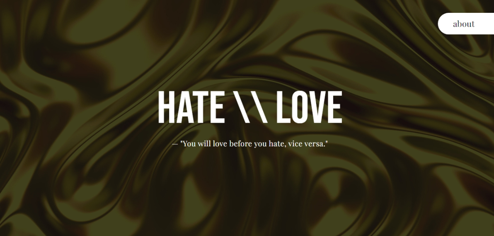

<div align="center">
  
</div>
<h1 align="center">HATE \\ LOVE</h1>
<p align="center"><i></i></p>
<div align="center">
  <a href="https://github.com/bersianturi/hate-love/stargazers"></a>
<a href="https://github.com/bersianturi/hate-love/network/members"></a>
<a href="https://github.com/bersianturi/hate-love/pulls"></a>
<a href="https://github.com/bersianturi/hate-love/issues"></a>
<a href="https://github.com/bersianturi/hate-love/graphs/contributors"></a>
<a href="https://github.com/bersianturi/hate-love/blob/master/LICENSE"></a>
</div>
<br>
<div align="center">
  <a href="https://bersianturi.github.io/hate-love">View Demo</a>
    ·
    <a href="https://github.com/bersianturi/hate-love/issues">Report Bug</a>
    ·
    <a href="https://github.com/bersianturi/hate-love/issues">Request Feature</a>
</div>

<!-- GETTING STARTED -->
## Getting Started

This is an example of how you may give instructions on setting up your project locally.
To get a local copy up and running follow these simple example steps.

### Installation

_Below is an example of how you can instruct your audience on installing and setting up your app. This template doesn't rely on any external dependencies or services._

* Clone the repo
  ```sh
  git clone https://github.com/bersianturi/hate-love.git
  ```

## Website

Link : https://bersianturi.github.io/hate-love

<a href="https://bersianturi.github.io/hate-love"></a>


<!-- CONTRIBUTING -->
## Contributing

Contributions are what make the open source community such an amazing place to learn, inspire, and create. Any contributions you make are **greatly appreciated**.

If you have a suggestion that would make this better, please fork the repo and create a pull request. You can also simply open an issue with the tag "enhancement".
Don't forget to give the project a star! Thanks again!

1. Fork the Project
2. Create your Feature Branch (`git checkout -b feature/NewFeature`)
3. Commit your Changes (`git commit -m 'Add some NewFeature'`)
4. Push to the Branch (`git push origin feature/NewFeature`)
5. Open a Pull Request


<!-- LICENSE -->
## License

Distributed under the MIT License. See `LICENSE.txt` for more information.


<!-- CONTACT -->
## Contact

Ber - [@bersianturi_](https://instragr.am/bersianturi_) - bernard.req@gmail.com

Project Link: [https://github.com/bersianturi/bemubsi](https://github.com/bersianturi/hate-love)
